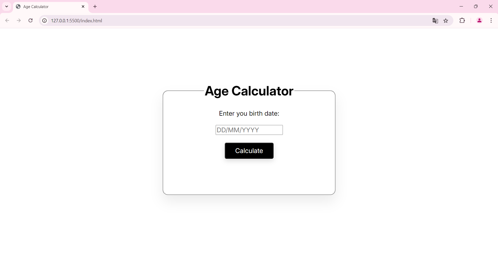

# 🧮 Calculadora de Idade

Este projeto é uma **Calculadora de Idade** desenvolvida com **HTML, CSS e JavaScript**, que permite ao usuário informar sua data de nascimento e obter automaticamente sua idade atual em anos.

O objetivo do projeto é praticar **manipulação de datas**, **lógica em JavaScript** e **interação com o DOM**, sendo ideal para portfólio e estudos iniciais em desenvolvimento web.

---

## 🚀 Funcionalidades

- Inserção da data de nascimento
- Cálculo automático da idade
- Resultado exibido de forma clara e objetiva
- Interface simples e intuitiva
- Validação básica de data

---

## 🛠️ Tecnologias Utilizadas

- **HTML5**
- **CSS3**
- **JavaScript (ES6+)**

---
## Para Teste
[Visite a Calculadora de Idade](https://agecalculator-2hxm.onrender.com)

##Screenshot



## 📂 Estrutura do Projeto

```text
calculadora-idade/
├── index.html
├── style.css
├── script.js
└── README.md
```

